 

  
<h2 align="center">POSTIFY SMART MAILBOX SYSTEM</h2>

Revolutionizing the way you handle mail with IoT technology.
 

 

**POSTIFY** is a revolutionary smart mailbox system that solves a common issue with traditional mailboxes: the inability to notify users of new mail arrivals. Designed with state-of-the-art technology, POSTIFY ensures that you never miss an important letter or document again. 

This project is built with a combination of hardware and software technologies, all planned, designed, built, and programmed by me - **R.A. Dulanjaya Bhanu Ranawaka**.

  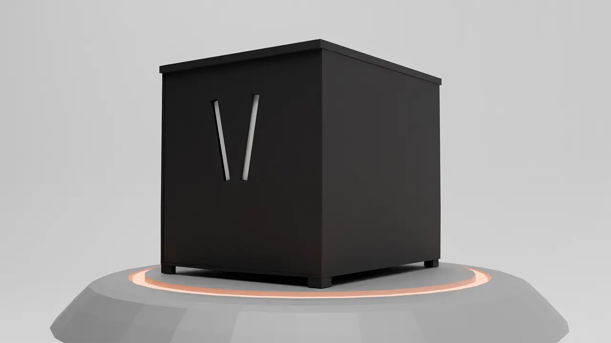
  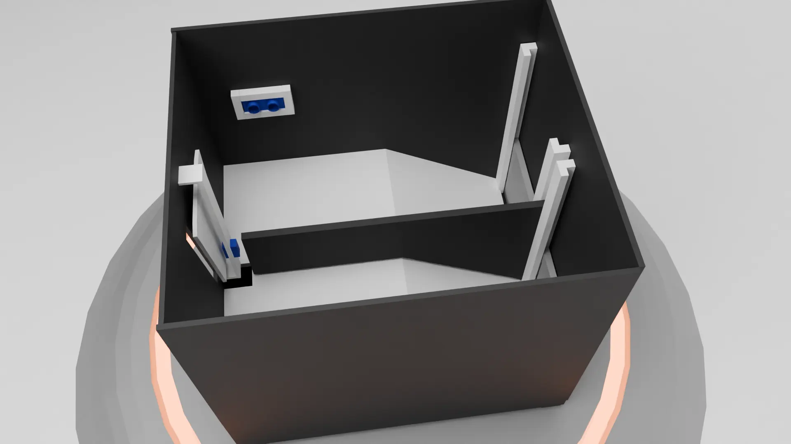

---

## Table of Contents

- [Introduction](#introduction)
- [Key Features](#key-features)
- [System Architecture](#system-architecture)
- [Hardware Components](#hardware-components)
- [Software Components](#software-components)
- [How It Works](#how-it-works)
- [Mobile Application Features](#mobile-application-features)
- [Business Architecture](#business-architecture)

---

## Introduction

The traditional mailbox has remained unchanged for decades, leading to significant problems, such as missing critical mail due to lack of timely notifications. POSTIFY is a smart mailbox system designed to:

- Notify users of new mail arrivals in real time.
- Provide insights into mail trends, including daily, weekly, and monthly statistics.
- Allow multiple family members to access mail records conveniently.

By integrating modern technology, POSTIFY aims to bring mailboxes into the digital era.

---

## Key Features

1. **Smart Mail Detection:**
   - Automatically detects valid and outdated mail insertions.
   - Sends notifications to the POSTIFY server.

2. **Rotating Paddle Mechanism:**
   
   

    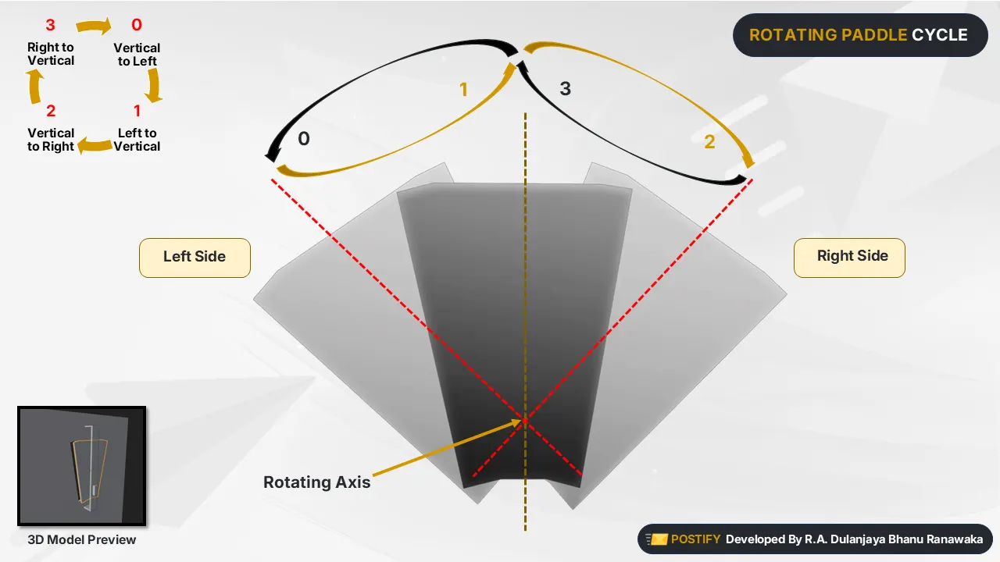
   

   
   - Default state is closed to prevent unauthorized access.
   - Opens only during mail insertion, controlled by a timer.

4. **Real-Time Notifications:**
   - Informs users of new mail via the POSTIFY Mobile Application.

5. **User-Friendly Retrieval:**
   - Two back-chamber doors allow easy access to collected mail.

6. **Robust Analytics:**
   - Monthly, weekly, and daily mail statistics.
   - Visual insights using pie and line charts.

---

## System Architecture

The POSTIFY system consists of three main components:

  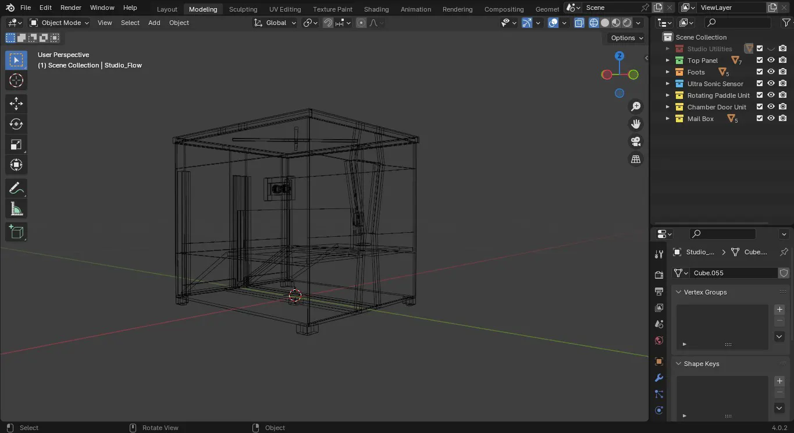
  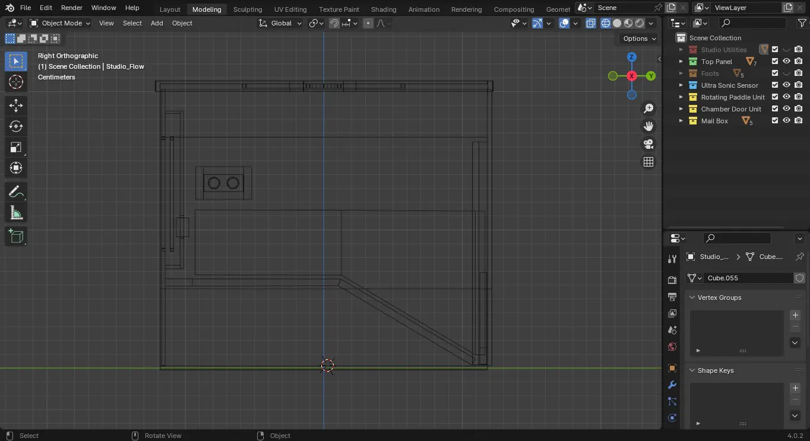

1. **Mail Box Device:**
   - Built with ESP32 Dev Kit for programming.
   - Features include mail detection, WiFi connectivity, and error handling.

2. **POSTIFY Server:**
   - Java EE7 RESTful API for database management and server logic.

3. **POSTIFY Mobile Application:**
   - React Native Mobile Application for user interface and notifications.

---

## Hardware Components

| Component            | Description                                   |
|----------------------|-----------------------------------------------|
| **ESP32 Dev Kit**    | Microcontroller for processing and Wi-Fi communication. |
| **SG90 Servo Motor** | Controls the rotating paddle for mail slot.  |
| **HC-SR04 Ultrasonic Sensor** | Detects incoming mail through the slot. |
| **LEDs** (x3)        | Indicate Wi-Fi status, errors, mail record transmission, and slot operation. |
| **Resistors** (200Ω) | Used to control current for LEDs.            |
| **Breadboard**       | Connects all electronic components.          |

---

## Software Components

- **Firmware:**
  - Programmed to control hardware components and manage the workflow.

- **POSTIFY Server:**
  - Developed to store and process mail data.

- **POSTIFY Mobile Application:**
  - Enables user interaction and provides mail statistics.

---

## How It Works

### Mail Insertion Process
1. The mail insertion hole is covered with a **rotating plate** in its default closed state.
2. The postman presses the *Open* button to open the **valid mail** slot.
3. An internal timer is started (20 seconds) to allow the postman to insert mail.
4. An ultrasonic sensor detects mail insertion and triggers the ESP32 to:
   - Send the mail record to the *Postify* server.
   - Store the information in the database.
5. After mail insertion, the timer resets for 20 seconds to allow additional mail insertions.
6. If no mail is inserted before the timer expires, the mailbox automatically closes both slots.

### Real-Time Notifications
- When mail is detected, a record is sent to the *Postify* server.
- Users are instantly notified via the *Postify* mobile app.

### Mail Retrieval
- Users can retrieve mail from two back-side doors, one for valid mail and another for outdated mail.

### LED Indicators
- **Wi-Fi Status**: Indicates connection during startup and operational modes.
- **Mail Record Transmission**: Lights up during communication with the server.
- **Error Signals**: Uses blinking patterns to indicate system errors.

---

## Mobile Application Features

  
  

- **Real-Time Notifications:**
  - Alerts users about new mail arrivals.

- **Mail Statistics:**
  - Daily, weekly, and monthly mail counts.
  - Total valid and outdated mail counts.

- **Data Visualization:**
  - Pie charts for monthly summaries.
  - Line charts for yearly summaries.

- **Account Management:**
  - Allows multiple family members to connect to one mailbox.

- **Device Details:**
  - View device information such as model number and status.

- **Historical Data Access:**
  - Access previous year’s mail summary data.

---

## Business Architecture

  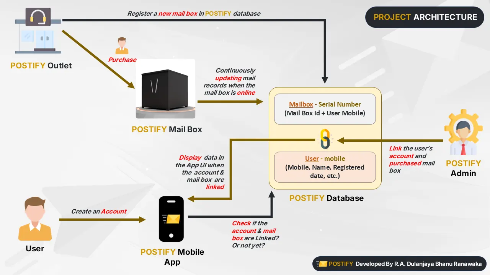

1. **Manufacturing:**
   - Mailboxes are manufactured by the POSTIFY company.

2. **Customer Purchase:**
   - Available through POSTIFY outlets.

3. **Account Registration:**
   - Customers create an account via the POSTIFY Mobile Application using their mobile number.

4. **Admin Setup:**
   - POSTIFY Admin links the customer to their mailbox via the Admin Panel.
   - Ensures that all family members can access shared mail data conveniently.

5. **Scalability:**
   - Designed to support thousands of customers with robust server architecture.
---

## Future Improvements

- **Solar Power Integration**: Adding solar panels for eco-friendly operation.
- **Advanced Categorization**: Using AI for automated mail classification (e.g., bills, advertisements).
- **Voice Control**: Integration with voice assistants like Alexa or Google Assistant.
- **RFID Integration**: Identifying senders using RFID tags.

---

## License

This project is licensed under the [Apache 2.0 License](https://www.apache.org/licenses/LICENSE-2.0). See the LICENSE file for details.

---

  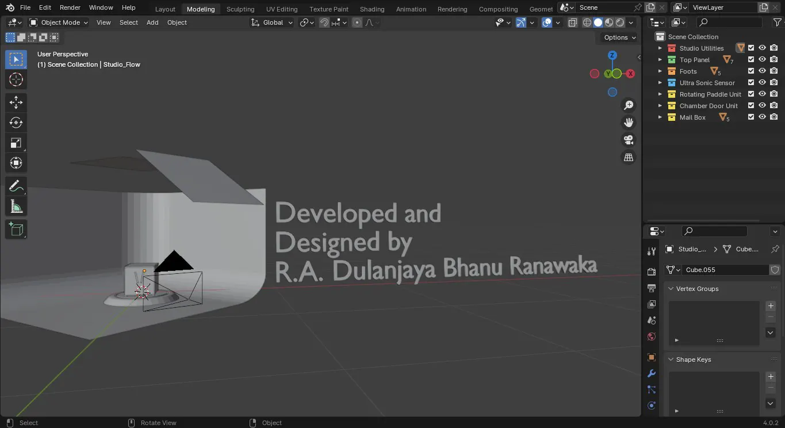
  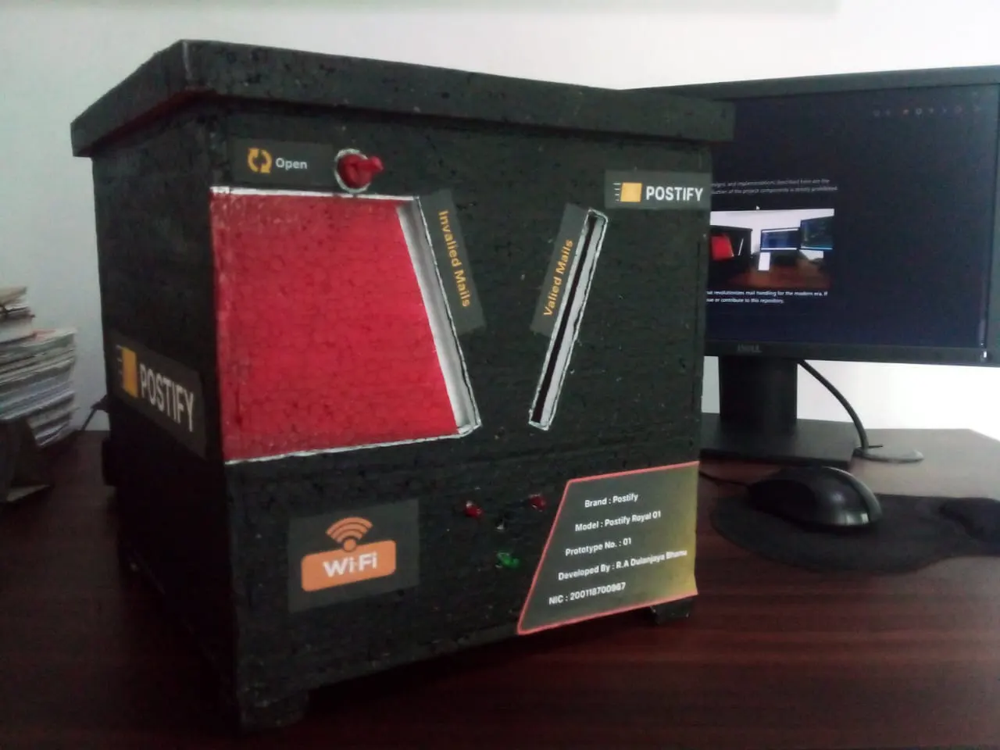
  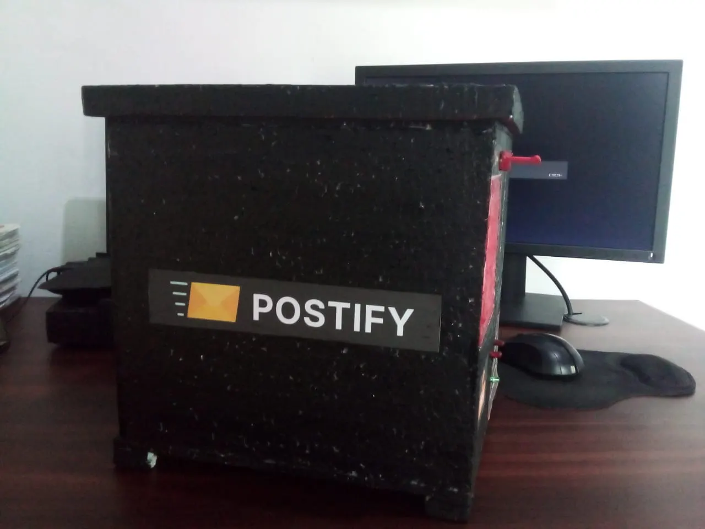
  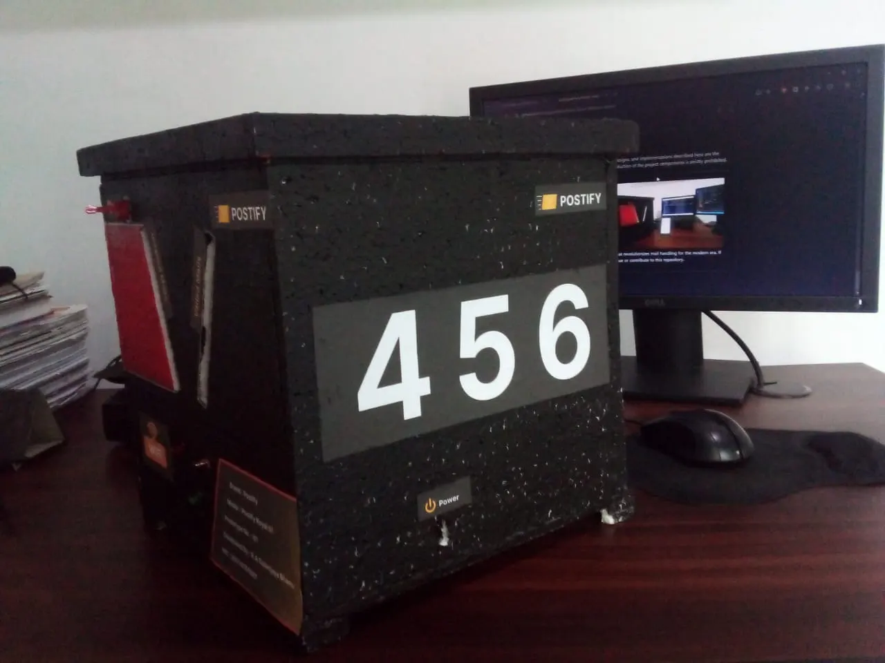
  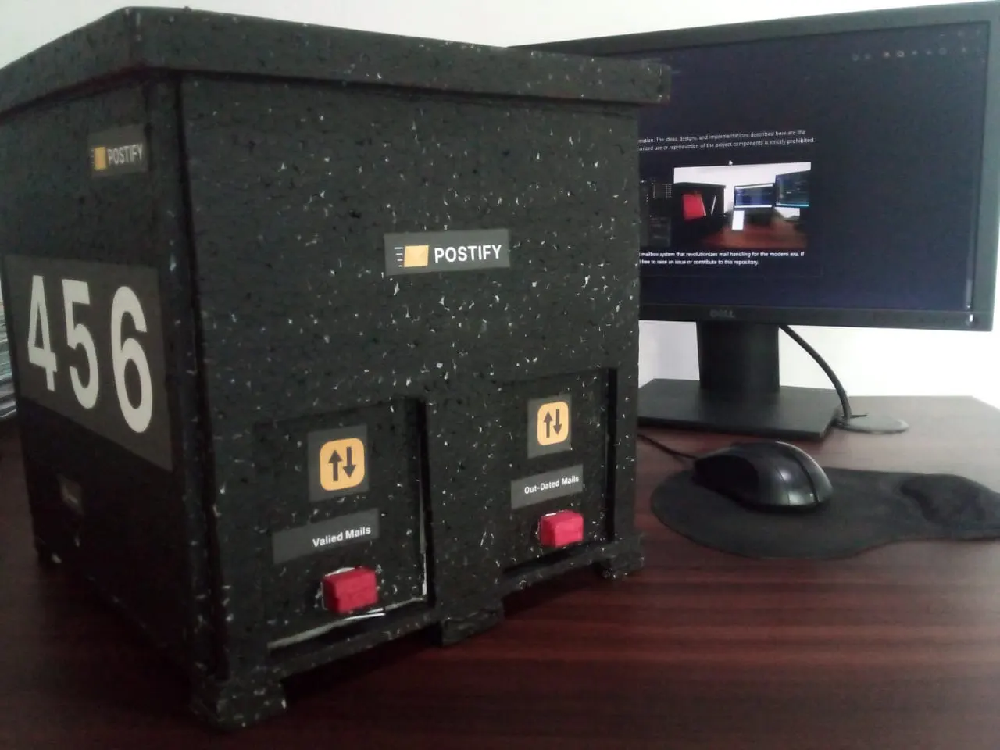

---

Thank you for exploring POSTIFY, the smart mailbox system that revolutionizes mail handling for the modern era. If you have any questions or suggestions, feel free to raise an issue or contribute to this repository.
